<h3><code>amine@github ~ $ ./contributions.sh</code></h3>

  

<h3><code>amine@github ~ $ whoami</code></h3>
<table>
  <tr>
    <td valign="top"></td>
    <td valign="top"></td>
  </tr>
</table>

 

<h3><code>amine@github ~ $ ls projects/</code></h3>

| Project | What it does | Stack |
|---|---|---|
| [**price-drop-tracker-bot**](https://github.com/Amineimmo/price-drop-tracker-bot) | Multi-user Telegram bot that tracks prices on Amazon, eBay and Jumia Maroc with automated background checks and instant drop alerts | Python · Playwright |
| [**lumi-ai**](https://github.com/Amineimmo/lumi-ai) | AI study assistant: turns academic PDFs into structured summaries, core definitions and active-recall flashcards using local text parsing and LLM structured outputs | Python · LLM |
| [**PDFMate**](https://github.com/Amineimmo/PDFMate) | Fast local CLI to extract text/Markdown, convert PDFs to Word, or render pages as PNGs, with no third-party web services | Python |
| [**Hex-viewer-V1**](https://github.com/Amineimmo/Hex-viewer-V1) | Command-line hex viewer showing binary files as hexadecimal and printable ASCII, 16 bytes per row (built to practice CS:APP) | C |

 

<h3><code>amine@github ~ $ contact --open-to internships</code></h3>

[**LinkedIn**](https://www.linkedin.com/in/aminebouhassoune/) &nbsp;·&nbsp; [**aminemestro@gmail.com**](mailto:aminemestro@gmail.com)

